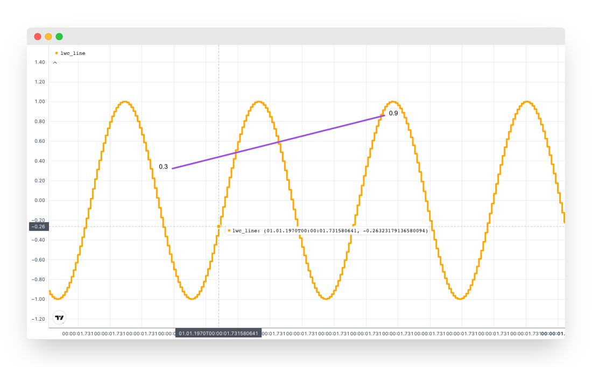

<picture>
  <source media="(prefers-color-scheme: dark)" srcset=docs/src/assets/animation_dark.gif>
  <source media="(prefers-color-scheme: light)" srcset=docs/src/assets/animation_light.gif>
  
</picture>

# LightweightCharts.jl

[](https://bhftbootcamp.github.io/LightweightCharts.jl/stable/)
[](https://bhftbootcamp.github.io/LightweightCharts.jl/dev/)
[](https://github.com/bhftbootcamp/LightweightCharts.jl/actions/workflows/CI.yml?query=branch%3Amaster)
[](https://codecov.io/gh/bhftbootcamp/LightweightCharts.jl)
[](https://github.com/JuliaRegistries/General)

LightweightCharts is a convenient Julia wrapper for the [Lightweight Charts™](https://github.com/tradingview/lightweight-charts) library by [TradingView, Inc.](https://www.tradingview.com/), designed to output graphical data to an HTML page.

## Installation
To install LightweightCharts, simply use the Julia package manager:

```julia
] add LightweightCharts
```
## Usage

Simple line chart with styling options:

```julia
using LightweightCharts

t_values = round(Int64, time()) .+ collect(1:500)
x_values = sin.((1:500) / 10)

chart = lwc_line(
    t_values,
    x_values;
    label_name = "lwc_line",
    line_color = "orange",
    line_width = 4,
    line_style = LWC_SOLID,
    line_type = LWC_STEP,
    price_scale_id = LWC_LEFT,
    plugins = LWCPlugin[
        lwc_trend_line(100, 0.32, 200, 0.86; line_color = "#9d4edd"),
        # lwc_delta_tooltip(),
        # lwc_vert_line(150),
        # lwc_crosshair_highlight_bar(),
        # lwc_tooltip(; title = "my_tooltip")
    ],
)

lwc_show(chart)
```



The package also support custom data types (for more information, see the [documentation](https://bhftbootcamp.github.io/LightweightCharts.jl/stable/pages/charts/#custom_data)). In the following example we used [TimeArrays](https://github.com/bhftbootcamp/TimeArrays.jl) to smooth prices:

```julia
using TimeArrays
using LightweightCharts

julia> prices = ta_price_sample_data()
7777-element TimeArray{DateTime, Float64}:
 TimeTick(2024-04-01T00:00:00.661, 0.6501)
 TimeTick(2024-04-01T00:05:57.481, 0.6505)
 ⋮
 TimeTick(2024-04-30T23:42:11.920, 0.4417)

panel = lwc_panel(
    lwc_line(
        prices;
        label_name = "price",
        line_color = "#adb5bd",
        line_type = LWC_STEP,
        precision = 4,
    ),
    lwc_line(
        ta_sma(prices, 20);
        label_name = "sma price",
        line_color = "red",
        precision = 4,
    ),
    lwc_line(
        ta_wma(prices, 20);
        label_name = "wma price",
        line_color = "orange",
        precision = 4,
    ),
    lwc_line(
        ta_ema(prices, 20);
        label_name = "ema price",
        line_color = "green",
        precision = 4,
    );
    name = "LightweightCharts ❤️ TimeArrays",
    default_legend_visible = false,
    h = 1.0,
)

lwc_show(panel)
```


Composite layout featuring diverse chart types:

```julia
using Dates
using NanoDates
using LightweightCharts

layout = lwc_layout(
    lwc_panel(
        lwc_area(
            NanoDate("2024-01-01") .+ Second.(1:500),
            map(x -> rand(1:500), collect(1:500));
            label_name = "lwc_area",
            line_color = "#49c7e3",
            top_color = "#74d7ed",
            bottom_color = "#85f2f000",
            line_style = LWC_SOLID,
            line_type = LWC_STEP,
            line_width = 2,
            precision = 3,
            price_scale_id = LWC_LEFT,
        ),
        lwc_line(
            NanoDate("2024-01-01") .+ Second.(1:500),
            map(x -> rand(1:500), collect(1:500));
            label_name = "lwc_line",
            line_color = "#ff5752",
            line_style = LWC_DASHED,
            line_type = LWC_SIMPLE,
            line_width = 3,
            price_scale_id = LWC_RIGHT,
        );
        last_value_visible = true,
        title_visible = true,
        default_legend_visible = false,
        x = 1,
        y = 1,
    ),
    lwc_panel(
        lwc_baseline(
            NanoDate("2024-01-01") .+ Second.(1:500),
            map(x -> rand(1:500), collect(1:500));
            label_name = "lwc_baseline",
            base_value = LWCBaseValue("price", 250),
            line_style = LWC_SOLID,
            line_type = LWC_CURVED,
            line_width = 3,
            precision = 4,
            price_scale_id = LWC_RIGHT,
        );
        x = 2,
        y = 1,
    );
    name = "LightweightCharts ❤️ Julia"
)

lwc_show(layout)
```


Scatter plot with distinct color:

```julia
using LightweightCharts

chart = lwc_panel(
    lwc_line(
        round(Int64, time()) .+ collect(1:5000),
        map(x -> 1.4 + rand([0.0:0.005:0.8..., 0.8:0.01:0.9...])^10.0, 1:5000);
        label_name = "scatter_purple",
        line_color = "#9558b2",
        point_markers_visible = true,
        line_visible = false,
    ),
    lwc_line(
        round(Int64, time()) .+ collect(1:5000),
        map(x -> 1.2 + rand([0.0:0.005:0.8..., 0.8:0.01:0.9...])^10.0, 1:5000);
        label_name = "scatter_green",
        line_color = "#389826",
        point_markers_visible = true,
        line_visible = false,
    ),
    lwc_line(
        round(Int64, time()) .+ collect(1:5000),
        map(x -> 1.0 + rand([0.0:0.005:0.8..., 0.8:0.01:0.9...])^10.0, 1:5000);
        label_name = "scatter_red",
        line_color = "#cb3c33",
        point_markers_visible = true,
        line_visible = false,
    );
    crosshair_settings = CrosshairOptions(;
        mode = LWC_CROSSHAIR_NORMAL,
        vert_line = CrosshairLineOptions(;
            style = LWC_CROSSHAIR_SOLID,
            color = "#C3BCDB44",
            label_background_color = "#9B7DFF",
            width = 8,
        ),
        horz_line = CrosshairLineOptions(;
            color = "#9B7DFF",
            label_background_color = "#9B7DFF",
        )
    ),
    last_value_visible = true,
    title_visible = true,
    max_y = 1.6,
    h = 1.0
)

lwc_show(chart)
```


## Contributing

Contributions to LightweightCharts are welcome! If you encounter a bug, have a feature request, or would like to contribute code, please open an issue or a pull request on GitHub.
