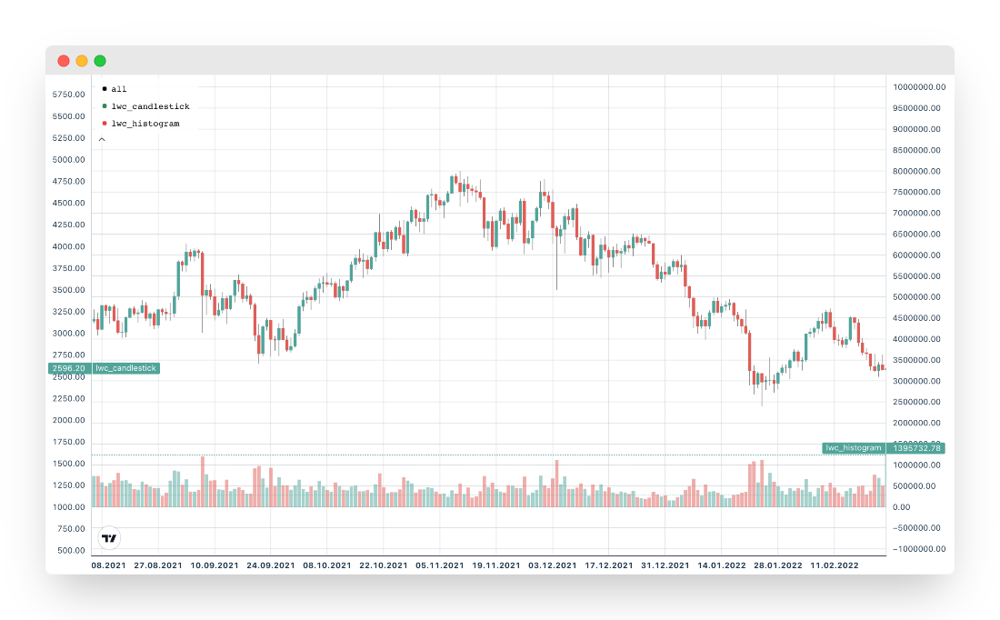
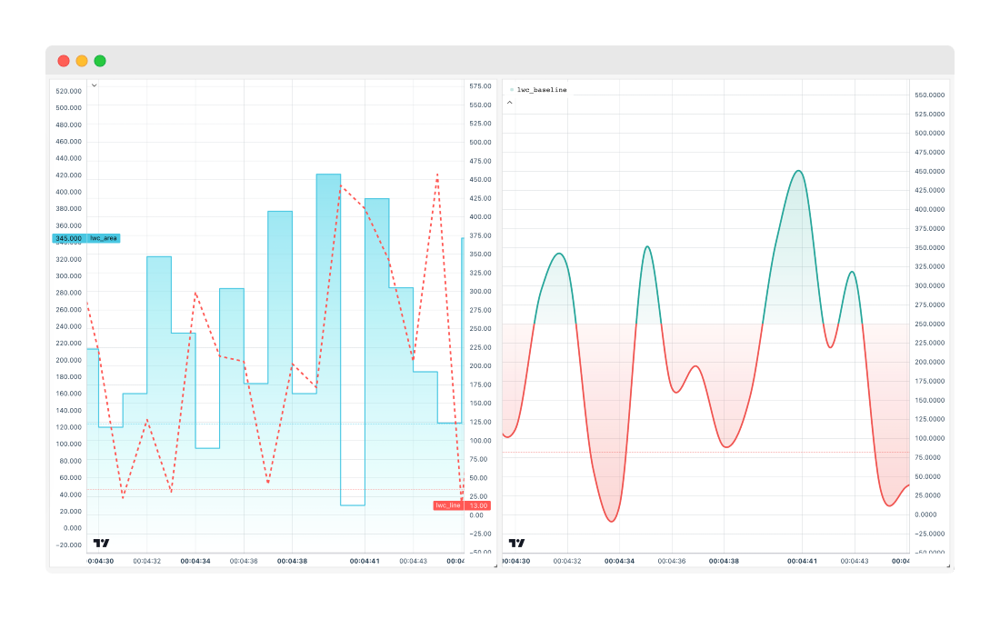

# LightweightCharts.jl

LightweightCharts is a convenient Julia wrapper for the [Lightweight Charts™](https://github.com/tradingview/lightweight-charts) library by [TradingView, Inc.](https://www.tradingview.com/), designed to output graphical data to an HTML page.

## Installation
To install LightweightCharts, simply use the Julia package manager:

```julia
] add LightweightCharts
```
## Usage

Simple line chart with styling options:

```julia
using LightweightCharts

t_values = round(Int64, time()) .+ collect(1:500)
x_values = sin.((1:500) / 10)

chart = lwc_line(
    t_values,
    x_values;
    label_name = "lwc_line",
    line_color = "orange",
    line_width = 4,
    line_style = LWC_SOLID,
    line_type = LWC_STEP,
    price_scale_id = LWC_LEFT,
    plugins = LWCPlugin[
        lwc_trend_line(100, 0.32, 200, 0.86; line_color = "#9d4edd"),
        # lwc_delta_tooltip(),
        # lwc_vert_line(150),
        # lwc_crosshair_highlight_bar(),
        # lwc_tooltip(; title = "my_tooltip")
    ],
)

lwc_show(chart)
```


Panel candlestick and histogram chart, (using data from [CryptoAPIs](https://github.com/bhftbootcamp/CryptoAPIs.jl)):

```julia
using Dates
using CryptoAPIs
using LightweightCharts

ohlc = CryptoAPIs.Binance.Spot.candle(;
    symbol = "ETHUSDT",
    interval = CryptoAPIs.Binance.Spot.Candle.d1,
    startTime = DateTime("2021-01-01"),
    endTime = DateTime("2023-09-27"),
    limit = 1000,
)

panel = lwc_panel(
    lwc_candlestick(
        map(
            x -> LWCCandle(x.openTime, x.openPrice, x.highPrice, x.lowPrice, x.closePrice),
            ohlc.result,
        ),
        label_name = "lwc_candlestick",
        up_color = "#52a49a",
        down_color = "#de5e57",
        border_visible = false,
        price_scale_id = LWC_LEFT,
    ),
    lwc_histogram(
        map(
            x -> LWCSimpleChartData(
                x.openTime,
                x.volume,
                color = x.openPrice > x.closePrice ? "rgba(222, 94, 87, 0.5)" : "rgba(82, 164, 154, 0.5)",
            ),
            ohlc.result,
        );
        label_name = "lwc_histogram",
        base = -100.0,
        price_scale_id = LWC_RIGHT,
    ),
    name = "ETHUSDT | Binance Spot",
)

lwc_show(panel)
```



Composite layout featuring diverse chart types:

```julia
using Dates, NanoDates
using LightweightCharts

layout = lwc_layout(
    lwc_panel(
        lwc_area(
            NanoDate("2024-01-01") .+ Second.(1:500),
            map(x -> rand(1:500), collect(1:500)),
            label_name = "lwc_area",
            line_color = "#49c7e3",
            top_color = "#74d7ed",
            bottom_color = "rgba(133, 242, 240, 0)",
            line_style = LWC_SOLID,
            line_type = LWC_STEP,
            line_width = 2,
            precision = 3,
            price_scale_id = LWC_LEFT,
        ),
        lwc_line(
            NanoDate("2024-01-01") .+ Second.(1:500),
            map(x -> rand(1:500), collect(1:500));
            label_name = "lwc_line",
            line_color = "#ff5752",
            line_style = LWC_DASHED,
            line_type = LWC_SIMPLE,
            line_width = 3,
            price_scale_id = LWC_RIGHT,
        ),
        x = 1,
        y = 1,
    ),
    lwc_panel(
        lwc_baseline(
            NanoDate("2024-01-01") .+ Second.(1:500),
            map(x -> rand(1:500), collect(1:500));
            label_name = "lwc_baseline",
            base_value = LWCBaseValue("price", 250),
            line_style = LWC_SOLID,
            line_type = LWC_CURVED,
            line_width = 3,
            precision = 4,
            price_scale_id = LWC_RIGHT,
        ),
        x = 2,
        y = 1,
    ),
    name = "LightweightCharts ❤️ Julia"
)

lwc_show(layout)
```



Scatter plot with distinct color:

```julia
using LightweightCharts

chart = lwc_panel(
    lwc_line(
        round(Int64, time()) .+ collect(1:5000),
        map(x -> 1.4 + rand([0.0:0.005:0.8..., 0.8:0.01:0.9...])^10.0, 1:5000);
        label_name = "scatter_purple",
        line_color = "#9558b2",
        point_markers_visible = true,
        line_visible = false,
    ),
    lwc_line(
        round(Int64, time()) .+ collect(1:5000),
        map(x -> 1.2 + rand([0.0:0.005:0.8..., 0.8:0.01:0.9...])^10.0, 1:5000);
        label_name = "scatter_green",
        line_color = "#389826",
        point_markers_visible = true,
        line_visible = false,
    ),
    lwc_line(
        round(Int64, time()) .+ collect(1:5000),
        map(x -> 1.0 + rand([0.0:0.005:0.8..., 0.8:0.01:0.9...])^10.0, 1:5000);
        label_name = "scatter_red",
        line_color = "#cb3c33",
        point_markers_visible = true,
        line_visible = false,
    ),
    max_y = 1.6
)

lwc_show(chart)
```


